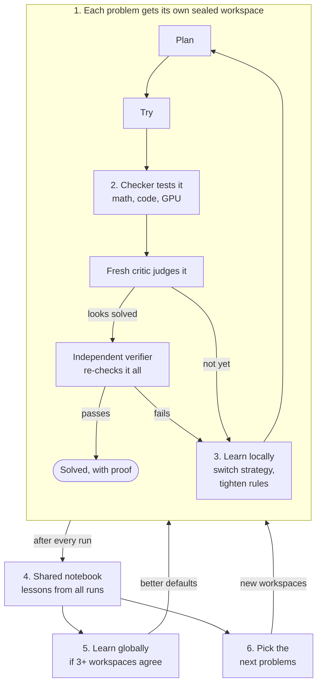
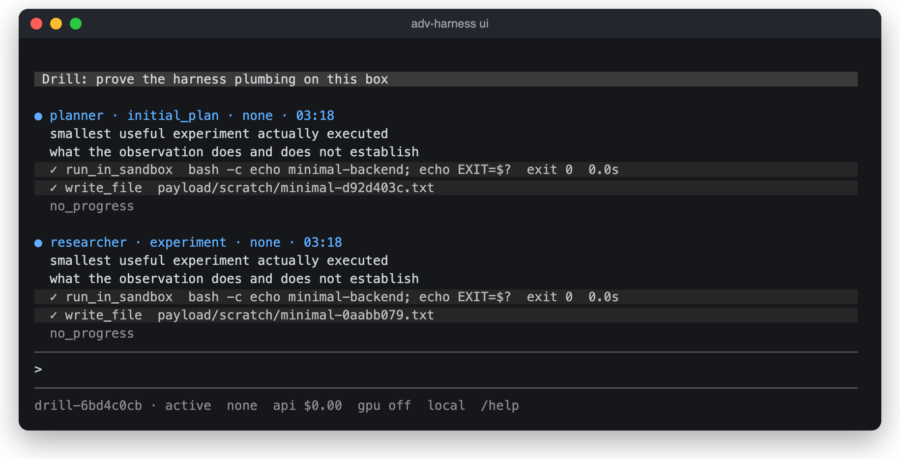
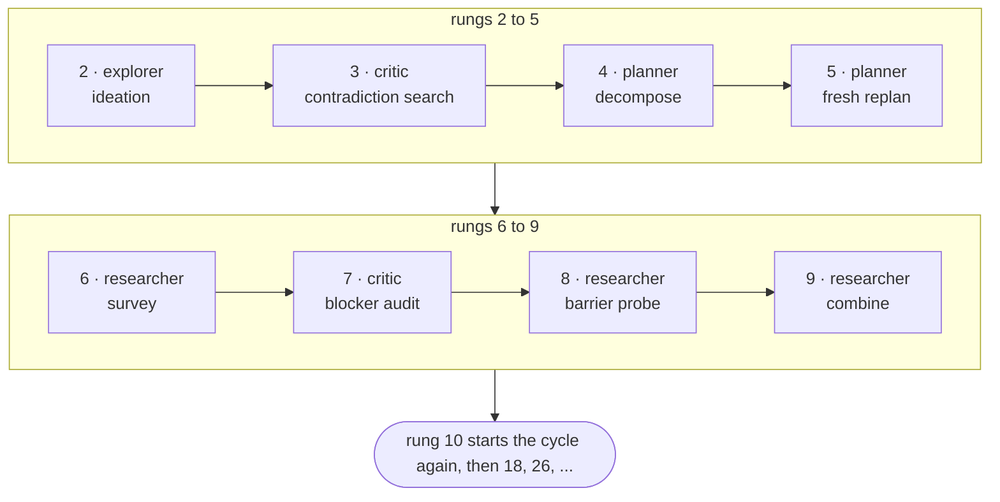
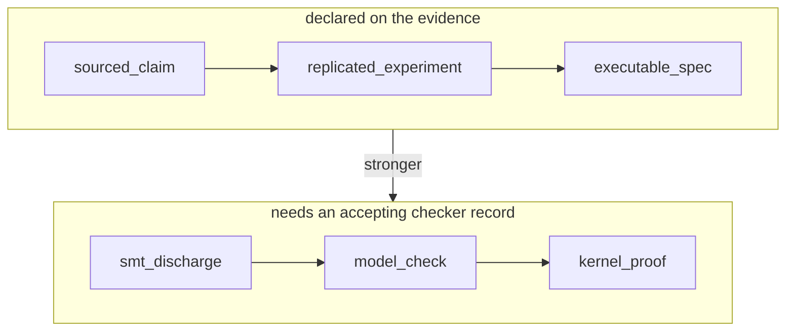
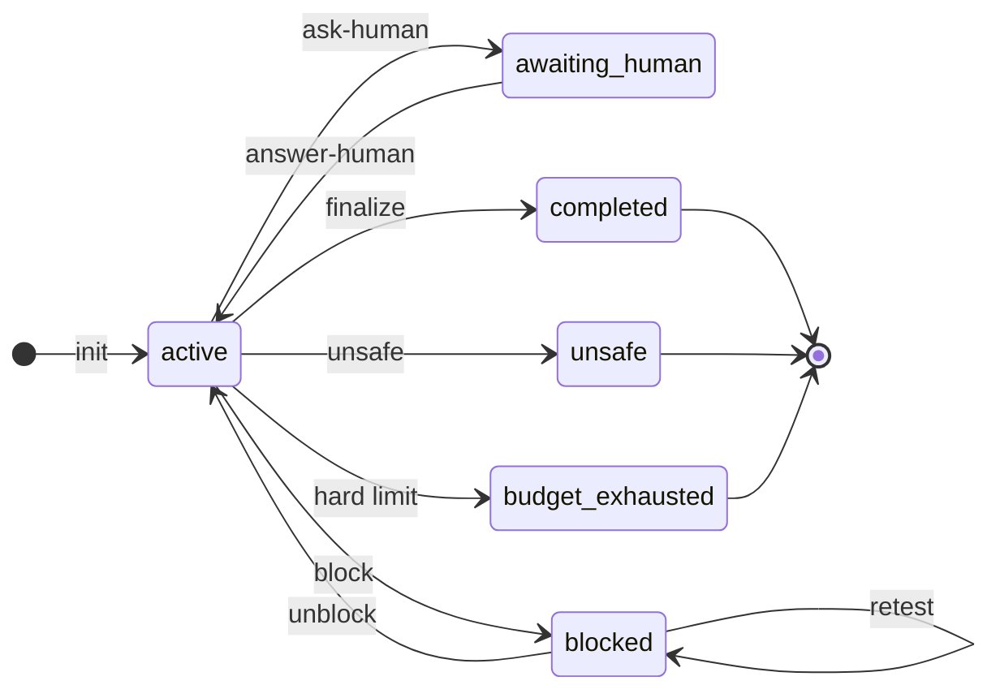

# ADV Loop

ADV Loop keeps AI agents working on hard problems until they can prove an answer, and makes them say so when they can't.

If you've left an agent alone with a hard problem, you've seen how it ends: a confident summary, and a result that falls apart when you check it. ADV Loop doesn't trust that summary. It records every attempt in a hash-chained log, sends each one to a critic that didn't write it, and hands the final answer to a verifier with a fresh context. A task closes only when a real checker accepts the evidence: a Lean kernel or z3 for math, a test command for code, a replayed run for GPU jobs.

Some problems have no answer you can reach. Those end as `blocked`, `unsafe`, or `budget_exhausted`, with the reason on file and a date to look again.

## How it works

A loop that solves problems, proves every answer, and gets better after each run: first inside one problem, then across all of them.



1. **Sealed workspace.** Every problem gets its own folder with its own files, history, and sandbox, so nothing leaks between problems.
2. **Checker.** A real tool decides if an attempt worked: Lean or z3 for math, a test command for code, a replay for GPU runs. The model's own word never counts.
3. **Learn locally.** When an attempt fails, the workspace switches strategy. If the same error keeps coming back, it tightens its own rules, and keeps a new rule only if a test shows it helps (`adv-harness refine`).
4. **Shared notebook.** After every run, the lessons go somewhere every workspace can read (`adv-loop commons`).
5. **Learn globally.** A fix spreads to all workspaces only when 3 or more separate workspaces show the same lesson and the fix passes testing in most of them (`adv-harness refine-global`). A fix scoped to one field profile needs 2.
6. **Pick the next problems.** The loop reads the notebook, chooses what to attack next, and opens a new workspace for each one (`adv-loop frontier`).

## Try it in a couple of minutes

You need Python 3.9 or newer and nothing else. The package runs on the standard library alone.

From a checkout of this repo:

```bash
python3 -m pip install -e .
python3 -m unittest discover -s tests -v
```

Then run the offline drill. It drives a throwaway workspace end to end with a stub in place of the model, so you need no API keys and spend nothing:

```bash
adv-harness drill --root /tmp/adv-demo/workspaces --state /tmp/adv-demo/state --backend minimal
adv-harness ui --root /tmp/adv-demo/workspaces --state /tmp/adv-demo/state
```

The drill prints its named checks as JSON. The second command opens the console on the workspace it built:

<p align="center">
  
</p>

<sub>The model column reads `none` because the drill's stub stands in for a real model, and the session text is the stub's boilerplate.</sub>

## The pitch, word by word

The short version is that ADV Loop is a fully autonomous discovery engine that can face any problem. That's a big sentence, and each word in it points at something concrete in the code:

- **Any problem.** `adv-loop intake` takes a folder, an archive, a file, or a text brief from any field and splits it into chartered workspaces. Hundreds can run side by side without touching each other.
- **Fully autonomous.** You write a one-sentence goal, and `prompts/compile-charter.md` turns it into a charter with criteria, budgets, standing grants, and boundaries. From there one `adv-loop fleet --watch` command runs everything to an end state without a human turn inside that envelope. The adapter does the thinking. The steward answers questions the charter already covers, probes revive blockers whose premise has died, and the surgeon amends the loop's own contract when the harness itself gets in the way.
- **Discovery.** A claim counts as discovered only when the strongest honest checker for its field accepts it, bound to the evidence fingerprint and signed. Prose can't satisfy a criterion that asks for a proof.
- **Engine.** Finished work feeds the commons, and the frontier proposes the next problems from the fleet's own wishes, barriers, and results. The loop creates work as well as consuming it.
- **Face.** The word is deliberate. Some problems have no reachable answer: an undecidable request, contradictory requirements, a safety boundary, data that doesn't exist. ADV Loop ends those as `blocked`, `unsafe`, or `budget_exhausted`, each with a retest schedule. It keeps the agent going while progress is possible and makes lying about the attempt impossible either way.

A human still writes or changes the charter, answers questions outside it, and owns the stated safety boundaries. The engine never automates `unsafe` away.

## The console

`adv-harness ui` opens a chat console in your terminal, and it works over SSH too (`ssh -t`). It rebuilds its view from the workspace files on every refresh, so it never holds state the kernel doesn't have. Each model session shows up as a `role · mode · model · time` line with its text. The tools that session ran fold into shaded rows with the command and exit code, and the footer shows the workspace, routing, spend, and the GPU box.

Type a slash command, or type plain text to answer a pending question or leave guidance for the next session.

| Command | What it does |
|---|---|
| `/new` | start a task: the task first, then its acceptance criteria |
| `/ws` | list workspaces; `/ws <n or name>` switches |
| `/step` | run one scheduled step (`/step 3` runs three) |
| `/run` | keep stepping until the task pauses, asks, or finishes |
| `/stop` | stop after the current step |
| `/pause`, `/resume` | hold future sessions, or release the hold |
| `/status` | budgets, routing, GPU box |
| `/evidence` | recorded evidence and ranks |
| `/sessions` | model sessions, tokens, and cost |
| `/report` | the final report, once written |
| `/tools` | expand or collapse tool output |
| `/quit` | leave; a running step still finishes |

Looking around costs nothing. Only `/step` and `/run` start model sessions, and they use the provider and budget you configured. For continuous work, run `adv-harness run` in another terminal and keep the console open on the same root.

A few more options:

- `adv-harness ui --classic` opens the older tabbed console, with a workspace sidebar, mouse support, and tabs for the conversation, an overview, evidence, sessions, the report, and models. Press `?` there for its keys.
- `adv-harness ui --remote HOST` mirrors a remote box's workspaces to your machine and runs every action on the box over SSH.
- After install, `adv-harness ui` works from any directory. It looks for the checkout in the current directory's parents, then falls back to the installed one. Explicit path flags win: `python3 -m harness.cli ui --root workspaces --state harness/state --repo .`

Provider endpoints come from the environment, with `/etc/adv-loop/env.d/harness` as a fallback. The loader reads plain HTTPS assignments from that file (quoted or prefixed with `export` is fine) and never runs it as a shell script. Values already in the environment win. API keys stay in each backend's credential files, and the loader never copies them into the process environment.

## Start a real task

Acceptance criteria are part of the proof boundary, so write them as things you could observe.

```bash
adv-loop init \
  "Recover the missing records and prove the output layout" \
  --criterion "Every source row is accounted for" \
  --criterion "The output layout matches the downstream contract" \
  --control "a known-good archive copy whose rows already reconcile"
```

`--control` is optional and you can repeat it. It names a negative control, something a correct mechanism must refuse to certify. The `proves_too_much` review lens runs claims against it, and any mechanism that endorses the control dies.

A few other flags worth knowing:

- `--max-attempts`, `--max-failures`, and `--deadline` set hard budgets. Only these can end a task as `budget_exhausted`.
- `--criteria-file criteria.json` takes structured criteria, either plain strings or `{"text": ..., "min_formalization_rank": "kernel_proof"}`, so a criterion can demand a minimum [rank](#proof-has-ranks) from the start.
- `--charter` hashes a compiled charter into the first event.
- `--policy 4.0` or `--policy 3.0` opts down from the current 5.0 rules.

`init` prints the workspace, its replayed state, and the first directive. A workspace holds:

```text
events.jsonl             authoritative hash-chained event log
.pending-event.json      temporary one-event write-ahead journal, only during a write
.pending-directive.json  transient obligation lease: the issued, not-yet-consumed directive
.on-record-status.json   transient durability-hook status (when on_record is configured)
.adv-loop.lock           cross-process writer lock
loop-config.json         optional operator config: on_record hook, stall horizon
state.json               replayed state projection
attempts.jsonl           complete attempt projection
evidence.jsonl           normalized evidence projection
task.md                  task and live criterion checklist
decision-log.md          important decisions and rejected alternatives
report.md                incomplete marker or verified final report
```

Leave the projections alone. If one looks wrong, `adv-loop audit --repair` rebuilds it from the valid events.

## Four ways to run it

### One step at a time

```bash
adv-loop next workspaces/<task-id>
adv-loop scaffold workspaces/<task-id>
adv-loop record workspaces/<task-id> /path/to/completed-attempt.json
adv-loop audit workspaces/<task-id>
```

`next` tells you the one role and mode the engine will accept right now, with its directive ID, the active plan, recent attempts, open contradictions, how novel the next strategy has to be, and the evidence that matters. `scaffold` gives you the right shape for that directive. Swap its placeholder claims for observations from real work before you `record` it.

On 5.0, a critic's `attempt_review` also carries `review_context`: the full target attempt and its evidence metadata, the exact criteria (including the ones the attempt claims to satisfy), and the event head. The critic uses it to hold partial work up against the whole requirement. It's review input only. It doesn't count as verification or add a submission field, and the evidence and independence gates stay the same. The [contract](protocols/loop.md#3-plan-experiment-and-critique) has the details.

When `next` returns `{"action": "finalize"}`, run:

```bash
adv-loop finalize workspaces/<task-id>
```

`finalize` replays the log from scratch, checks every proof gate, verifies all projections, and only then appends `task_completed`.

Now and then the scheduler asks for ideas instead of experiments. `explorer/ideation` wants 3 to 24 speculative seeds from a fresh context with no history, and `critic/triage` then kills or promotes each seed. Promoted seeds become scored candidates. `next --explore` and `scaffold --explore` request an ideation round of your own whenever the free researcher slot comes up.

### With your own agent

`drive` talks JSON over stdin and stdout to any model runner or agent executable:

```bash
adv-loop drive workspaces/<task-id> -- python3 my_agent_adapter.py
```

On each cycle your adapter receives:

```json
{
  "workspace": "/absolute/path/to/workspaces/task-id",
  "directive": {"action": "attempt", "role": "planner", "mode": "initial_plan"},
  "rejections": [],
  "retry": 0
}
```

It prints one attempt submission as JSON on stdout. If validation fails, the errors come back on the same directive so the adapter can fix them. If the directive has changed in the meantime, another worker won the race, and the driver refreshes state instead of overwriting it. `drive` finalizes by itself once the proof and report gates pass.

```bash
adv-loop drive workspaces/<task-id> \
  --adapter-retries 3 \
  --timeout 900 \
  --max-cycles 100 \
  -- python3 my_agent_adapter.py
```

`--max-cycles` pauses the driver and leaves the task's state alone. When `next` returns `await_human`, `drive` stops with `driver_status: "paused"` and the recorded question in `next`, without calling the adapter or logging a fault. Run it again after an authorized `answer-human`. Only `attempt` directives ever reach the adapter.

### On autopilot

Compile a charter from a one-sentence goal with `prompts/compile-charter.md`. You get criteria with honest ranks, budgets, standing grants, boundaries, and an escalation policy. `adv-loop init --charter` hashes it into the chain, and its text rides along on every adapter call.

Two adapters ship with the repo. `adapters/claude_adapter.py` uses the official Anthropic SDK. `adapters/fireworks_adapter.py` talks to Fireworks AI's OpenAI-compatible API with nothing but the standard library; set `FIREWORKS_API_KEY` and `FIREWORKS_MODEL`, plus `ADV_LOOP_PRICE_IN_USD` and `ADV_LOOP_PRICE_OUT_USD` so the spend ceilings can bind. Both open a fresh model conversation for every attempt, which gives you context independence by construction. They run experiments through contained sandbox tools, fingerprint real artifacts, and log every call to a per-workspace spend ledger.

To leave it running:

```bash
adv-loop fleet --watch --inbox drops/incoming -- python3 adapters/claude_adapter.py
```

The fleet takes in new drops, drives every workspace that owes work, and lets the steward answer the questions your charter covers. The steward never answers a `safety_boundary` question. The fleet also files retest and wish probe outcomes and unblocks tasks whose blocking premise has died. It stops when you create the kill file (`<root>/.fleet-stop`), when spend hits `--spend-ceiling-usd`, or when a pass finds nothing owed, and its report says which one it was.

`adv-loop commons` exports every workspace's assets, lessons, and reports so the others can cite them. `adv-loop frontier` asks a generator to propose the fleet's next problems as new inbox drops. The reference checker hooks live in `checkers/`: a Lean kernel, z3, a generic command runner, and the GPU replay and replicate checkers.

On top of all this sits `adv-harness`. It adds per-role model routing (`adv-harness route` shows who answers what), budgets, per-workspace containers (`adv-harness provision`), session transcripts, and the two learning passes from the diagram at the top.

### With a GPU

A workspace whose charter grants GPU compute gets three more tools. The grant looks like this in `charter.json`:

```json
{"harness": {"gpu": {"enabled": true, "max_hours": 12}}}
```

- `gpu_run` starts `adv-gpu-box` (one A10G) if it isn't up, pushes only the declared inputs, runs the job inside the pinned GPU image, waits for it to finish, and pulls only the declared outputs back into the workspace.
- `gpu_collect` finishes a job whose session died.
- `gpu_status` reports on the box and never starts it.

A pulled output is only an observation until the `gpu-replay` checker accepts it, which earns rank `executable_spec`. Two matching jobs compared through `gpu-replicate` reach `replicated_experiment`. GPU hours come out of the AWS budget (`.gpu-spend.jsonl`, `harness/aws/budget-guard.md`) and never touch the model-call ledger, and the box stops itself when it sits idle.

You drive the box from your own machine with `harness/aws/adv-ctl`. The one-time AWS setup scripts (`setup-iam.sh`, `launch-gpu-box.sh`, `setup-budgets.sh`) read your instance, key pair, and security group from environment variables, and they print every change before they apply it. `adv-harness drill --gpu` exercises the whole path offline against a fake box, and `--gpu-live` runs it against the real one.

## What the engine won't let an agent do

- **Pick its own next step.** The engine decides the legal role and phase. The model answers the directive it was given.
- **Write against a stale view.** Every directive is tied to the current head of the event log, so the engine rejects stale or out-of-order writes.
- **Repeat itself.** Each experiment names six strategy dimensions and gets a fingerprint that can never be reused. After repeated failures, a retry has to change several dimensions at once.
- **Grade its own homework.** A critic in a different context reviews each research attempt before it can move the failure counter. Verification repeats the check for every criterion from a fresh context, with evidence of independent provenance.
- **Claim a criterion without proof.** Satisfying a criterion takes direct evidence linked to it, with an immutable fingerprint.
- **Paper over a contradiction.** A critical contradiction stays open until new evidence resolves it.
- **Blur what it knows.** The final report keeps facts, inferences, uncertainties, and limitations apart.
- **Dress up a failure.** `blocked`, `unsafe`, and `budget_exhausted` each have their own gate, and none of them can pass for `completed`.
- **Rewrite history.** The hash-chained event log is the source of truth. Every other file in the workspace is a projection you can rebuild from it.

## When attempts keep failing

The engine counts failures per criterion and demands a different kind of move at each rung. Two failures in a row send the explorer back for new ideas. Seven bring a blocker audit. After rung nine the ladder starts over eight rungs higher, so a long streak keeps producing new demands, and progress on one criterion never silences the ladder for another.



## Proof has ranks

A criterion can demand a minimum formalization rank, and then prose can't satisfy it:

```bash
adv-loop init "Prove the bound" --criteria-file criteria.json
```

```json
[{"text": "The bound is machine-checked from the recorded axiom base",
  "min_formalization_rank": "kernel_proof"}]
```

The ladder is frozen, weakest to strongest:



The bottom three ranks go on the evidence as declared. From `smt_discharge` up, the evidence needs an accepting checker record whose artifact hash matches the evidence fingerprint. Verification evidence has to meet the rank too, so verifying a rank-gated criterion means a second accepted checker run. Overlays can raise a criterion's rank and can never lower it.

The strongest honest check differs by field. [profiles/formal-mathematics.md](profiles/formal-mathematics.md) shows the proof-kernel shape, and [profiles/literature-biomedical.md](profiles/literature-biomedical.md) covers a field whose honest ceiling is an executable spec.

Sometimes the harness itself is what keeps failing: a missing hook, an unpinned tool, a class of error the loop has no rung for. Repeated fault signatures then schedule `surgeon/overlay_diagnosis`. The surgeon classifies the problem and proposes an overlay that can only add or tighten rules, a fresh-context review adopts or rejects it, and the loop carries on under the amended contract without waiting for you. From 4.0 on, `ask-human` has to say what the human is needed for, and the engine refuses a `harness_gap` request and names the surgeon as the next legal step.

## How a task ends



Nobody can declare a task complete from the outside. Completion needs:

1. direct evidence for every satisfied criterion;
2. no open critical contradiction;
3. exact per-criterion verification from a fresh context with independent provenance;
4. a later structured report with an exact evidence map;
5. a valid event chain and projections that match byte for byte.

`blocked` asks for more than "this is hard." The loop has to reach its scheduled blocker audit after seven critic-confirmed failures, document at least three diverse safe strategies that failed, attach direct evidence of the external dependency, and state the exact action a human needs to take.

`unsafe` can stop right away, because gathering more evidence might itself cross a safety, privacy, legal, or authorization line. `budget_exhausted` happens only when a hard limit set at `init` runs out.

## Honest stops

```bash
adv-loop guard workspaces/*             # exit 0 only if nothing owes work
adv-loop status workspaces/<task-id>    # state + supervision: lease age, owed rungs, stall
adv-loop ask-human workspaces/<task-id> ask.json      # {"request_id", "question"} -> awaiting_human
adv-loop answer-human workspaces/<task-id> ans.json   # {"request_id", "answer"}  -> active
adv-loop retest workspaces/<task-id>                  # due premise/wish rechecks
adv-loop retest workspaces/<task-id> --record out.json  # file a task_retested outcome
adv-loop unblock workspaces/<task-id> unblock.json    # blocked -> active when the premise fails
adv-loop add-criterion workspaces/<task-id> add.json  # strictly additive new goal (3.0)
adv-loop fulfill-wish workspaces/<task-id> wish.json  # record external progress (3.0)
```

Put `guard` in your agent session's stop hook; AGENTS.md has a snippet ready to paste. With it wired in, a session can't end while a workspace holds a pending directive, an owed escalation rung, or a due retest. The agent has to do the work, or pause on the record with `ask-human`.

For durability, drop a `loop-config.json` into the workspace:

```json
{"on_record": ["sh", "-c", "git -C ../.. add -f . && git -C ../.. commit -qm sync && git -C ../.. push -q"],
 "stall_horizon_seconds": 21600}
```

The hook runs after every append. A failed run prints an error, and `status` tells you how many events sit past the last success. `scripts/persist-events.sh` is a fuller version: it commits the audited files, the payload, and the harness sidecars by name, then retries the push.

## Bigger setups

### Sort a drop into workspaces

```bash
adv-loop intake ~/drops/mixed-bundle --dry-run     # propose the partition; writes nothing
adv-loop intake ~/drops/mixed-bundle --apply       # create isolated workspaces + payload/
adv-loop intake brief.md --apply                   # a markdown brief: title -> task, bullets -> criteria
adv-loop intake drop.zip --apply -- python3 classify.py   # optional classifier adapter
```

Intake hashes every file into a manifest and splits the drop by structure: one project per top-level component when a split is safe, and otherwise one workspace whose first criterion is to partition the drop. It copies the payloads, checks their hashes after the copy, and seeds `loop-config.json` with hints from what it found (a `uv.lock` suggests a `uv` sandbox, and `.lean` files suggest a formalization backend). It never fetches URL lists. An adapter can propose a better partition through the same validated contract, and the supervisor interprets nothing either way. `payload/` holds evidence source material and is never a projection.

### Drive the whole root

```bash
adv-loop fleet --root workspaces --dry-run                       # the schedule, no drives
adv-loop fleet --root workspaces --max-parallel 4 -- python3 my_agent_adapter.py
```

One pass looks at every workspace the way `guard` does. It skips terminal and `awaiting_human` rows, reports due retests on blocked rows, and exits 2 on a corrupt row without spoiling the rest of the pass. Then it drives the rows that owe work, escalations and diagnoses first, at most N at a time, each capped by `--max-cycles-per`. A workspace's own `adapter` in `loop-config.json` beats the one on the command line. `fleet` exits 0 only when nothing owes work, so it fits in a cron job or a stop hook.

### Sandboxes and checker hooks

```bash
adv-loop sandbox workspaces/<task-id> --init      # create payload/ + sandbox/, run the declared setup
adv-loop validate workspaces/<task-id> proof-check
adv-loop record-fault workspaces/<task-id> fault.json   # {"request_id","signature","source","detail"}
```

```json
{
  "adapter": ["python3", "my_agent_adapter.py"],
  "sandbox": {
    "kind": "uv", "root": "sandbox",
    "command": ["uv", "run", "--frozen"], "setup": ["uv", "sync", "--frozen"],
    "lockfile_hashes": {"sandbox/uv.lock": "<sha256>"}
  },
  "validators": {
    "proof-check": {"command": ["python3", "checkers/run_check.py"], "in_sandbox": true, "rank": "kernel_proof"}
  }
}
```

A sandbox is a declaration. The kernel runs only the argv lists you wrote, treats setup failures and lockfile drift as observations, and never special-cases the `kind` label. `validate` runs a registered hook the way the driver would and prints its attested verdict, `{accepted, checker_id, checker_version, artifact_hash, log_hash}`, plus an `evidence_hint` in the engine's exact field names, ready to paste into the next attempt. A rejection counts as a successful observation and exits 0; only contract violations fail the run. Hooks adopted through an overlay (audited, in state) beat `loop-config.json` entries. `adv-loop keygen` creates the workspace attestation key that signs these verdicts.

## Policy versions

Each workspace pins the policy version it was created under, and old workspaces replay byte for byte under their frozen rules. New workspaces get 5.0, and each version keeps everything from the one before it.

| Version | What it adds |
|---|---|
| 3.0 | Governed stopping: obligation leases, `guard`, an honest `awaiting_human` pause, and a `blocked` state you can revive. Scheduled research thinking: ideation seeds, forced triage, scored candidates, evolution, novelty memory, move-typed experiments, registries for barriers, wishes, assets, and lessons, review lenses with negative controls, and the escalation ladder. |
| 4.0 | Drop in anything with `intake` and drive it with `fleet`. The surgeon diagnoses the harness itself and proposes tighten-only overlays. A criterion can demand a minimum formalization rank, and evidence below that rank can't satisfy it. `ask-human` is kept for what only a human can give: authorization, credentials, private data, safety boundaries, and real external dependencies. |
| 5.0 | The autonomy plane: charters compiled from a one-sentence goal, shipped adapters for Anthropic and Fireworks, the always-on `fleet --watch` loop with a steward, reference checkers, the commons, and the frontier. |

## Recovery

```bash
adv-loop audit workspaces/<task-id>
adv-loop audit workspaces/<task-id> --repair
adv-loop migrate workspaces/<legacy-v1-task>
```

After a crash, recovery finishes a valid pending event and recreates every projection. It refuses to rewrite a corrupt event history. Migration never invents v2 proof for a v1 claim. It keeps the original directory, records a SHA-256 manifest in a new sibling workspace, and reopens every criterion.

## What it can't promise

ADV Loop gives you process integrity. It can't tell you what is true. A fingerprint means something only if the adapter hashed the bytes it observed. `agent_id`, `context_id`, and provenance keys are claims the adapter makes, unless your deployment adds signed identities, content-addressed artifacts, and a remote append-only store. Anyone with write access to the machine can recompute a local hash chain, so if Byzantine tampering is a concern, add external signatures or replicated storage. `adv-loop mirror` keeps an append-only copy of the event log and refuses to sync if the two have diverged.

## Further reading

[docs/architecture.md](docs/architecture.md), [protocols/loop.md](protocols/loop.md), and [schemas](schemas/) spell out the full contract. [profiles/](profiles/) runs the same machinery in six unrelated fields: empirical ML, formal mathematics, literature and biomedical research, operations debugging, security audits, and systems software. The engine can't tell them apart, and the test suite's neutrality lint keeps it that way.
