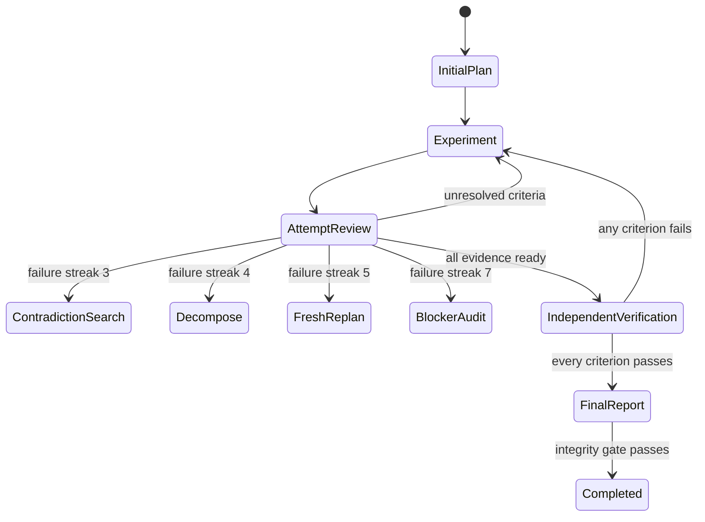

# Architecture

ADV Loop separates task reasoning from control authority. Models propose attempts; the kernel decides whether the transition is legal and whether its proof is sufficient.

Four policy versions coexist. Each workspace is pinned to the version stamped into its `task_created` event, and the version enters every historical directive's hash basis, so semantics can never drift under a recorded log. `2.0` is frozen: its scheduler, gates, and projections are byte-identical forever, and the repository's real 2.0 workspaces replay clean against the current code. `3.0` adds governed stopping and the researcher-thinking engine (below) without touching a single 2.0 code path. A short set of additive events (`human_input_requested/provided`, `task_retested`, `task_unblocked`) is accepted on 2.0 logs too, since they cannot appear in any existing bytes; everything else new initializes only in 3.0 state. `4.0` inherits every 3.0 behavior and adds formalization ranks, per-workspace contract overlays, and harness diagnosis (below). `5.0` — the default for new workspaces, with `--policy 4.0/3.0` to opt down — adds one audited field (`charter_hash`, binding the standing-authorization charter into the chain) and the autonomy plane around the kernel: the reference adapter, the always-on fleet with steward and probes, shipped checkers, the commons, and the frontier ([policy-5.0.md](policy-5.0.md)). Every version's state keys, events, and gates initialize only under its own pin, so older logs replay byte-identically.

## Components

### `storage.py`: durable authority

`events.jsonl` is the only source of truth. Each event contains a contiguous sequence number, prior-event hash, request ID, payload, timestamp, and its own SHA-256 hash. Every append runs under an OS file lock.

Before an append, the complete event is fsynced to `.pending-event.json`. The store then appends and fsyncs the event log before removing the journal. Recovery handles three cases:

1. the journal exists but the log append never began: append the journaled event;
2. the append completed but journal cleanup did not: verify the matching event and remove the journal;
3. the append tore mid-record: archive the torn bytes, truncate only the provably matching partial suffix, and append the complete journaled event.

An unexpected torn suffix, invalid JSON, sequence gap, changed prior hash, or content-hash mismatch is an integrity failure. Recovery does not guess.

### `policy.py`: deterministic scheduler

The next role and mode are a pure function of replayed state. A directive ID hashes the policy version, event head, revision, role, mode, and target attempt. Two workers may read the same directive, but the lock serializes their writes; after one succeeds, the other's directive is stale.

The core lifecycle is:

The scheduler always services an outstanding escalation before allowing more ordinary research or verification.

### Review context (5.0 directive view)

A researcher's satisfaction claim changes criterion state before its critic runs.
Filtering a review down to `open_criteria` therefore hides the very acceptance text
the critic must judge. V5 `attempt_review` directives include a `review_context`
with the full target attempt (observations, uncertainties, updates, and original
evidence metadata), all exact criteria including claimed-satisfied ones, and the
current event head. It is reconstructed from replay, copied to prevent mutation
through the view, and adds no stored state, gate, event, or directive-ID input.
Older policy directive views are unchanged. See the
[wire contract](../protocols/loop.md#3-plan-experiment-and-critique).

This makes review inputs available without loading an entire workspace history.
It cannot determine whether an artifact entails the criterion: the adapter must
inspect the evidence and judge the full requirement. The reference adapter labels
the packet's claims as untrusted review material, reminds the critic that partial
work is not satisfaction, and keeps its fresh conversation/identity behavior.
No copied evidence counts as an independent verification pass. Payload size grows
with one target attempt and the criterion set; there is no silent truncation of
load-bearing text and no automatic artifact execution or retrieval.

### Directive framing: `instructions` and `encouragement`

Every `attempt` directive carries two text blocks. `instructions` are contractual: they restate
what the engine will enforce when the attempt is recorded. `encouragement` is motivational
framing — a base line, a mode-specific line, an extra line once the failure streak reaches two,
and an honesty anchor. Supportive phrasing of this kind ("keep going", "you are equal to this
task") measurably improves model effort and persistence on long multi-step work, which is exactly
where this harness operates: an agent that gives up at attempt four never reaches the escalation
ladder that makes the loop valuable.

Two design rules keep the encouragement from corroding the proof gates:

- **The honesty anchor is unconditional.** Every encouragement block ends by stating that an
  evidence-backed `blocked` / `unsafe` / `budget_exhausted` stop is a legitimate finish and an
  unearned completion is not. Persistence pressure is aimed at effort, never at the terminal
  gates — which remain enforced by the engine regardless of any wording.
- **Encouragement is outside the directive-id basis.** The directive ID hashes policy version,
  event head, revision, role, mode, and target attempt. Rewording encouragement therefore never
  invalidates an in-flight directive, so the text can be tuned freely without breaking leases.

### `engine.py`: transition and proof gates

The engine validates a submission before it reaches storage:

- directive, role, mode, and active-plan identity;
- globally unique idempotency key;
- actor, model, and context identity;
- complete six-dimensional strategy and novelty distance;
- falsifiable hypothesis, executed action, raw observation, bounded interpretation, uncertainty, and next step;
- normalized evidence, criterion updates, contradictions, resolutions, and decisions;
- role-specific plan, critique, verification, blocker, or report contracts.

Evidence IDs are assigned by the engine. An attempt uses local evidence refs, preventing collisions and forward references to invented global IDs.

### Replay and projections

Replay begins at `task_created` and derives all state. Attempts and evidence are deep-copied from events before derived fields such as critic reviews are attached, so replay cannot mutate the in-memory event envelope. The following files are deterministic projections:

- `state.json`
- `task.md`
- `attempts.jsonl`
- `evidence.jsonl`
- `decision-log.md`
- `report.md`

An audit renders the expected bytes and compares them with disk. `--repair` atomically replaces mismatched projections. Completion refuses to proceed while any projection differs.

### `driver.py`: provider-neutral compute loop

The driver invokes any executable without a shell. The adapter reads one JSON envelope from stdin and prints one JSON submission to stdout. Contract failures are fed back for bounded correction retries. Adapter exhaustion raises a machine-readable operational error while leaving the task active and resumable; it does not forge `blocked` or `budget_exhausted`.

Only `attempt` directives reach that adapter. `await_human` returns a nonterminal
`paused` driver result with the recorded question and no model invocation or
fault append, including when a stale in-flight attempt loses to a recorded pause.
Resumption still requires the existing authorized answer event. Unrecognized
controller actions fail before model invocation.

## Proof model

Criterion state has two layers:

1. a research or critic claim with criterion-linked direct evidence;
2. a verifier result with new direct evidence whose context, provenance key, and content fingerprint differ from the primary evidence.

The verifier must cover the exact criterion set. One failed result reopens that criterion. Any later research invalidates prior verification and the report.

Critical contradictions are first-class state. They block verification until a later attempt resolves them with evidence produced in that attempt.

Open noncritical contradictions do not block verification, but the structured report must enumerate their exact IDs so they cannot disappear during synthesis.

The synthesizer cannot change criterion status. It must reproduce the exact primary and verification evidence map, cite direct evidence for facts, label inferences with confidence, and include limitations. Its rendered report is hashed into the completion event.

## Failure and terminal semantics

A research claim does not change the failure streak until a fresh-context critic reviews it. `validated_progress` resets the stagnation epoch; `mixed`, `no_progress`, and `invalid` increment it. This prevents a researcher from escaping escalation by labeling its own output “progress.”

The terminal states are mutually exclusive:

- `completed`: every proof, report, chronology, and integrity check passes;
- `blocked`: the mandatory blocker audit, three diverse critic-confirmed failures, dependency evidence, and exact human action all agree;
- `unsafe`: a stated boundary and halted action are recorded, with evidence optional;
- `budget_exhausted`: a configured attempt, failure, or time limit is reached.

Supervisor pauses and adapter process failures are not task terminal states.

## Policy 3.0: governed stopping and scheduled research thinking

3.0 was designed from a ledger of eight real stops on a frontier task where the loop, in `active` state with a legal directive pending, never objected to the agent walking away — plus a prior session's `blocked` whose premise later became false with no path back. Two pillars answer that, both enforced structurally so they stay field-agnostic.

### Pillar A — stopping is a state

- **Obligation lease.** `next` writes `.pending-directive.json` (a transient sidecar, *not* a chain event — a chain event would advance the head and stale the very directive it announced). `record` clears it. It is never part of the audited projection set.
- **The guard.** `adv-loop guard` exits nonzero while any workspace holds an unmet obligation (pending directive, owed escalation rung, due retest). Dropped into a session stop-hook, it makes idling-with-owed-work impossible; deferral is not accepted as work.
- **`awaiting_human`.** A non-terminal status entered by `human_input_requested` and left by `human_input_provided`, so pausing on a question is honest, visible, and resumable rather than indistinguishable from abandonment.
- **Revivable `blocked`.** A 3.0 block must carry a `retest {premise, probe?, recheck_after}`; `task_retested` records rechecks and a falsified premise makes the guard demand revival; `task_unblocked` returns to `active` with history intact. The block gate also refuses while the ladder still owes any demand.
- **Durability hook.** An optional `on_record` command runs after every append; failures are surfaced loudly and tracked in a sidecar, so an event log living only in an ephemeral machine is a supervised condition.

### Pillar B — research thinking is scheduled

- **Two-tier generation.** `explorer/ideation` emits 3–24 proof-inert, streak-neutral seeds from a history-free directive (the actor attests `context_scope: "minimal"`); a forced `critic/triage` in a fresh context kills or promotes each, ≤3 becoming candidates with deterministic Elo scores from recorded pairwise debates. Every second ideation is `evolve`-kind over the top candidates. Seed claims are fingerprinted permanently.
- **Conceptual-novelty memory.** Beyond the six process dimensions, every seed and experiment declares a **basin**; two confirmed failures close it, and re-entry requires a `representation_shift` folded into the fingerprint. Validated progress reopens it.
- **Move-typed experiments.** `test / survey / barrier_probe / combine / replicate`, backed by an assets ledger (with unused-pair `combine` memory), a barriers registry, and a wishes registry whose `wish_fulfilled` event is the designed entry point for external progress.
- **Sharper review.** Reviews rotate an assigned **lens**; `proves_too_much` runs the claim against a declared negative **control**. At per-criterion streak ≥ 3, a non-validated review must record ≥ 2 candidate causes with discriminating tests, feeding a **lessons** ledger that every `fresh_replan` must answer. `criterion_added` events let a discovered better question become an additive tracked goal.
- **A ladder that cannot run out or be soothed.** Failure streaks are per-criterion; the ladder fires on the highest open streak, so a validated side-quest never silences the stuck criterion. Rungs are cyclic — thresholds `offset + 8·cycle`, marks `demand@criterion#cycle`, move-typed rungs interleaved — so an unbounded streak yields an unbounded stream of distinct demands.

### Domain neutrality

Every 3.0 gate operates only on schema structure — presence, hashes, counts, set membership, ordering — never on domain content. A neutrality lint in the test suite scans `src/` for vocabulary from five dissimilar fields and fails on any hit, and `profiles/` documents the same machinery instantiated in empirical ML, security auditing, biomedical literature research, and operations debugging. The engine cannot tell them apart.

## Policy 4.0: formalization gates, overlays, and the supervisor plane

4.0 makes the loop an all-given architecture: drop in anything, run hundreds of unrelated projects side by side, let each amend its own contract when the harness itself is the bottleneck, and refuse to call a claim done until the field's strongest honest checker accepted it. Design note: [policy-4.0.md](policy-4.0.md).

### Kernel additions (all 4.0-gated)

- **Formalization ranks.** A frozen ladder `sourced_claim < replicated_experiment < executable_spec < smt_discharge < model_check < kernel_proof`. A criterion may pin a `min_formalization_rank`; satisfying, verifying, and completing it then require direct evidence at or above that rank on the same item. Ranks at or above `smt_discharge` require an accepting `checker` record `{checker_id, checker_version, accepted, artifact_hash, log_hash?, toolchain_hash?}` whose artifact hash *is* the evidence fingerprint — so a rank-gated verification is structurally a second accepted checker run, never a second paragraph.
- **Process faults.** `process_fault_recorded` is a non-terminal observation: an opaque signature hash of a repeating error class, appended by the driver on adapter exhaustion (the task stays active). The kernel counts repeats; it never interprets the failure.
- **Harness diagnosis.** Enough repeats of one signature (default 3), a critic review flagged `harness_gap: true`, or a rank-gated criterion with no registered checker backend schedule `surgeon/overlay_diagnosis` — above every adapter-issued step, below `finalize`. The surgeon classifies the condition (harness gap / research failure / human dependency) and, for a gap, proposes an overlay delta. Never keyed to failure streaks: scientific stuckness stays on the escalation ladder.
- **Overlays.** A fresh-context `critic/overlay_review` must `adopt`, `reject`, or `narrow` (a subset) each proposal; on adoption the engine itself appends `contract_overlay_adopted` — monotonic revisions, content-hashed delta, bound to the diagnosis and review attempts — atomically behind the review. The delta language is a nine-operation allowlist (register evidence kind / validator hook / sandbox, add stall class / role instructions / criterion, require or raise a criterion rank, pin a toolchain hash) validated tighten-only at proposal, at review, at adoption, and again at replay. No operation can skip a review, loosen a gate, lower a rank, reinterpret a terminal, or touch another workspace. Adoption moves the event head, so every in-flight directive stales and the next `next` serves the amended contract.
- **ask-human is for humans.** A 4.0 `human_input_requested` must classify what the human is for (`external_dependency`, `authorization`, `private_data`, `safety_boundary`, `other_human_judgment`); `harness_gap` is refused by name, and asking is refused outright while a diagnosis or review is owed. `mark_unsafe` remains reachable always. The blocked gate likewise refuses while diagnosis is owed.

### Supervisor plane (outside the kernel)

- **Intake** (`adv-loop intake`) sorts a drop — directory, archive, file, or stdin brief — into isolated 4.0 workspaces: a hashed manifest, a structural field-neutral partition (or a single partition-this-drop task when splitting is unsafe), payload files copied under `workspaces/<id>/payload/` with post-copy hash verification, suggestions seeded into `loop-config.json`. An optional classifier adapter proposes a better partition through the same validated JSON contract. Dry-run writes nothing anywhere.
- **Fleet** (`adv-loop fleet`) realizes the parallel scheduling extension point: enumerate a root (only real event-log directories — no lock-file litter), reuse the guard's obligation logic per row, skip terminal and `awaiting_human`, prioritize owed rungs and diagnoses, and drive at most N workspaces concurrently. Each drive serializes on its own workspace lock; stale directives do the rest — there is no global lock. A corrupt workspace is one bad row.
- **Sandboxes** (`adv-loop sandbox`) are declared, never assumed: `loop-config.json` names a kind label, a root, setup/run argv lists, and lockfile hashes; the kernel runs only declared argv and treats drift or failure as an observation.
- **Checker hooks** (`adv-loop validate`) run a registered validator subprocess and print its attested verdict plus an evidence hint in exactly the engine's field names. Overlay-registered hooks (audited, in state) win over machine-local `loop-config.json` entries. An `accepted: false` verdict is a successful observation.
- **Write containment**: every path these tools write resolves through one choke point (`pathsafe`) that rejects escapes; archive extraction is member-by-member with symlink/traversal/byte-cap defenses. This is a contract against accidents, not an OS jail — a declared subprocess still runs with the invoking user's permissions.

## Extension points

The kernel stays model- and tool-neutral. Production deployments can add:

- a hosted-model adapter;
- content-addressed artifact storage that computes fingerprints itself;
- signed actor/context and checker attestations;
- remote or replicated append-only event storage;
- domain-specific evidence validators (realized in 4.0 as registered checker hooks with attested verdicts);
- a strategy-distance function with semantic embeddings;
- parallel portfolio scheduling above the stale-directive protocol (realized in 4.0 as the fleet runner; remaining extension: cross-machine scheduling).

## Honest limits

The controller enforces consistency and provenance claims; it cannot inspect a model's private reasoning or guarantee that an adapter truthfully described an observation. Local hashes detect accidental and unsophisticated tampering, not a malicious writer that can replace and rehash the full log — append-only mirrors (`adv-loop mirror`, fleet `mirror_to`) turn silent local rewriting into loud divergence, and 5.0's keyed checker attestations (`adv-loop keygen` + enforced HMAC verdicts) stop an adapter from *imagining* an accepting checker; a deliberately malicious local process with filesystem access can still read the shared key, so asymmetric signatures and remote key isolation remain the extension point. The reference adapter makes context independence mechanical (fresh model conversation per attempt); third-party adapters' context IDs remain assertions. Path containment is a contract against accidents and hostile archives, not an OS-level jail. Formalization strength varies honestly by field: a rank ladder cannot give biology a proof kernel, and overlays can only tighten what a task demanded at creation, never weaken it. These are explicit boundaries, not hidden guarantees.
